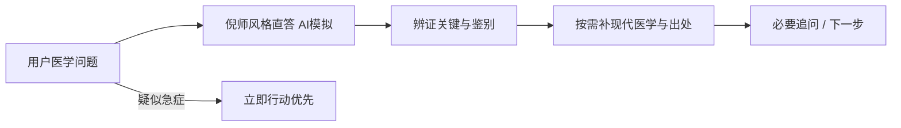

<h1 align="center">倪海厦 Skill</h1>

<p align="center"><strong>把症状、报告、疾病、经方、中药和医案拿来问。</strong></p>

<p align="center">
  倪师课堂风格直答 · 8 个医学模块 · 581 条医案索引 · 现代医学补充
</p>

<p align="center">
  <a href="https://github.com/Fangx-AI/ni-haixia-perspective/releases/latest"></a>
  <a href="LICENSE"></a>
  <a href="https://github.com/Fangx-AI/ni-haixia-perspective/stargazers"></a>
  <a href="https://github.com/Fangx-AI/ni-haixia-perspective/actions/workflows/validate.yml"></a>
  
</p>

---

这不是一个只会考据“倪海厦说过什么”的资料库，也不是把所有问题都套上阴阳概念的角色扮演。

它首先用**倪师课堂答问的方式直接回答**：先说往哪个辨证方向看、关键在哪里；再按需要补充现代医学、危险信号和出处。不是先讲一遍产品如何工作。

它不是只有一段人物提示词。安装后会同时获得可检索的六经、方证、金匮、本草针灸、重病模块，医案来源索引，速查卡和原话/视频证据路由。AI 会先命中相关知识，再组织回答。

| 你拿来问 | 你会得到 |
|---|---|
| “我怕冷、没汗、后颈发紧，怎么理解？” | 急症信号筛查、太阳表证候选与鉴别问题、现代常见/危险可能、下一步 |
| “这份血常规和肝功能有什么问题？” | 异常项优先级、指标组合与趋势、常见解释、复诊需要确认什么 |
| “小柴胡汤到底什么情况才讨论？” | 经典方证、倪师课程解释、相近方区别、禁忌与不适合自行套方的原因 |
| “生附子和炮附子有什么区别？” | 历史药性与方证、公开课出处、毒性和特殊人群风险，不给个人剂量 |
| “倪海厦怎样看糖尿病、失眠、癌症？” | 人物观点、医案、当前指南与证据分别呈现，不把个案当疗效证明 |
| “这个B站切片里的处方是真的吗？” | 回溯原课和时间点，区分原话、整理稿、标题包装与医学证据 |

> 它不会远程冒充医生确定诊断，也不会给个体化剂量或指导自行针刺；但它也不能只用一句“请咨询医生”把你打发走。一个合格回答至少应告诉你：**现在有多急、有哪些候选解释、还缺什么信息、下一步做什么。**

## 这套 Skill 里实际有什么

| 知识层 | 内容 | 回答中的作用 |
|---|---|---|
| 速查层 | 六经总表、相近方鉴别、最小问诊、安全规则 | 几秒内确定回答方向 |
| 医学模块 | 六经、经方、黄帝内经基线、金匮、本草针灸、争议主张、重病、高频问答 | 给出有内容的倪师框架直答 |
| 医案层 | 581 条去重医案与临床日志元数据 | 按病名/主题找相似公开病例并回到原文 |
| 证据层 | 8,058 条来源、300 条高传播视频、10 个时间戳包、18 条原子主张 | 核验“他说过吗”和切片上下文 |
| 安全层 | 医学帮助协议与当前证据检索规则 | 急症先处理，历史观点不冒充现实处方 |

### 问题怎样命中知识

```text
“怕冷、无汗、后颈紧”
  └─ 六经速查 → 太阳模块 → 桂枝/麻黄/葛根方证鉴别

“小柴胡汤什么时候谈”
  └─ 方名索引 → 经方模块 → 少阳模块 → 风险与缺失信息

“有没有癌症医案”
  └─ 重病模块 → 581条医案索引 → 打开原始来源 → 对照当前肿瘤证据

“这个B站切片真是他说的吗”
  └─ 主张账本 → 300条视频登记 → 时间戳包 → 完整课程回溯
```

## 30 秒开始

```bash
npx skills add Fangx-AI/ni-haixia-perspective -g -a codex -y
```

安装后直接问医学问题：

```text
我昨天开始怕冷、没有汗、后颈很紧，还有轻微发热。倪海厦会怎么回答？
```

也可以显式调用：

```text
$ni-haixia-perspective 帮我解释这份体检报告：先说最值得关注的异常，再给倪氏框架与现代医学两层分析。
```

## 热门医学问题，倪师风格会怎样直答

以下均为基于公开课程的 **AI 模拟回答**，不是倪海厦本人原话，也不构成个人诊断或处方。

### 1. 怕冷、无汗、后颈痛，是不是麻黄汤证？

> **倪师风格直答（AI模拟）**：怕冷、无汗、项背紧，照六经先往太阳伤寒上看。可是三项症状还不能直接定方，关键要看脉浮不浮、身体痛不痛、喘不喘、口渴不口渴。方证要合，不能看到“无汗”两个字就套麻黄汤。
>
> **必要补充**：若同时高热、剧烈头痛、颈部僵硬到低头困难、意识异常、呼吸困难或胸痛，应优先急诊评估。

### 2. 总在凌晨一点到三点醒，是肝有问题吗？

> **倪师风格直答（AI模拟）**：一点到三点是肝经当令，所以会先从肝的疏泄和藏血去想，但不能一醒就说肝脏有病。要看你是烦醒、热醒、痛醒，还是打鼾憋醒；白天精神、饮酒、药物和情绪也要一起看。时辰是线索，不是诊断书。

### 3. 体检有几个箭头，但人没有不舒服，需要管吗？

> **倪师风格直答（AI模拟）**：人舒服不等于所有数字都可以不管，数字有箭头也不等于就是大病。先看它偏了多少，是单独一项还是几项一起动，再和去年比较；同时看睡眠、胃口、体力、大小便有没有变化。整体状态和检查结果要合起来看，不能只信一边。

### 4. 小柴胡汤什么时候用？我这种情况能不能用？

> **倪师风格直答（AI模拟）**：小柴胡汤不是“口苦就吃”，它抓的是少阳枢机不利：往来寒热、胸胁苦满、心烦喜呕、默默不欲饮食，这些要放在一起看。若表证还重、里证又杂，方就可能不同。先辨是不是少阳，再谈小柴胡，顺序不能倒过来。

### 5. 生附子、炮附子是不是一个救急、一个补阳？

> **倪师风格直答（AI模拟）**：不能只记成“生附子救急、炮附子补阳”八个字。照课程的讲法，生附子偏向里寒重、阳气将脱的方向，炮附子更多用于阳虚、寒湿和表阳不足一类；到底用哪个，要看方证和全身寒热虚实。附子有毒，这个只适合学理论，不能自己买来煮。

### 6. 癌症患者能不能照倪海厦医案用药？

> **倪师风格直答（AI模拟）**：医案是教你怎么看病机，不是给所有癌症患者抄同一张方。病位、寒热、体力、胃口、睡眠、大小便和正在接受的治疗都不同，照抄就是拿别人的钥匙开你家的门。可以学他的辨证思路，但不能据此停掉或替换现有肿瘤治疗。

## 默认顺序：先直答，再补必要信息



### 1. 先像课堂答问一样把话说清楚

- 先说往哪个辨证方向看；
- 再说最关键的判断点；
- 不用“Skill 会……”介绍产品能力。

### 2. 再补辨证关键

不是一句“你就是某证”，而是列出最相关的 1–3 个候选：

- 哪些表现支持；
- 哪些表现不符合；
- 还要问什么才能区分；
- 相关课程、条文、方证或医案在哪里。

### 3. 现代医学与安全信息按需出现

- 普通问题简短补充，不抢走主回答；
- 方药问题说明关键风险，不重复长免责声明；
- 疑似急症时立即行动必须放在最前面。

## 能力边界：有帮助，不越过诊疗线

| 可以做 | 不会做 |
|---|---|
| 结构化分析症状并分级风险 | 冒充医生作确定诊断 |
| 给出倪氏辨证和方证候选 | 把候选写成“你就是这个证” |
| 解释体检、化验和影像报告 | 仅凭一张报告替代完整评估 |
| 讲经方组成、方证、配伍和鉴别 | 给个人剂量、加减、疗程和购买指引 |
| 讲中药历史用途、毒性和相互作用 | 指导自行使用或炮制高风险药材 |
| 解释针灸选穴逻辑和公开医案 | 指导自行深刺、危险部位或用针灸替代急救 |
| 比较倪海厦观点与当前证据 | 劝用户停药、拒绝检查或替代标准治疗 |

## 研究底座

| 资料 | 当前规模 | 医学回答中的用途 |
|---|---:|---|
| 来源记录 | 8,058 | 寻找课程、文章、视频和镜像线索 |
| 显式来源家族 | 7,023 | 识别转载和重复页面，避免重复计票 |
| 内部去重语料 | 3,629篇 / 443万汉字 | 检索课程、文章与医案；完整正文不在公开仓库再分发 |
| 高传播视频索引 | 300条 | 发现热门症状、方剂和争议切片，并回溯原课 |
| 时间戳研究包 | 10个 | 从长视频定位到可复核时间段 |
| 原子医学主张账本 | 18条 | 展示人物归属、风险和现代核验状态 |
| 医案索引 | 581条 | 按主题检索公开医案和临床日志并回到原文 |

公开仓库保留来源元数据、短证据指针和衍生研究；详细口径见 [来源摘要](references/source-registry/global-source-summary.json) 与 [公开发行清单](PUBLICATION_MANIFEST.json)。

## 可直接复制的问题

```text
我有这些症状：<症状、持续时间、严重程度>。请先做急症筛查，再给倪氏辨证候选、现代医学鉴别和我现在该观察什么。
```

```text
帮我看这份化验单：不要只解释箭头，请结合指标组合、趋势、用药和症状，告诉我最值得优先确认什么。
```

```text
小柴胡汤在《伤寒论》和倪海厦课程中的方证是什么？和桂枝汤、柴胡桂枝汤怎样鉴别？请同时说明风险，但不要给个人剂量。
```

```text
倪海厦公开医案中怎样讨论糖尿病？请列出处、辨证思路和证据局限，再对照当前糖尿病管理原则。
```

```text
这个B站视频说“<主张>”。请回溯完整课程与时间点，并判断它能不能支持视频标题的医学结论：<链接>
```

```text
我是癌症治疗中的患者，目前方案是<方案>，主要困扰是<症状/副作用>。请不要替我改治疗，帮我理解倪海厦相关观点、当前证据和下次与肿瘤团队要问的问题。
```

## 安装与更新

### 通用安装器

```bash
npx skills add Fangx-AI/ni-haixia-perspective -g -a codex -y
```

### Git 安装

macOS / Linux：

```bash
git clone https://github.com/Fangx-AI/ni-haixia-perspective.git ~/.codex/skills/ni-haixia-perspective
```

Windows PowerShell：

```powershell
git clone https://github.com/Fangx-AI/ni-haixia-perspective.git "$env:USERPROFILE\.codex\skills\ni-haixia-perspective"
```

更新：

```bash
npx skills update ni-haixia-perspective -g -y
```

## 仓库结构

```text
ni-haixia-perspective/
├── SKILL.md                          # 医学帮助优先的核心指令
├── expression_style.md               # 倪师风格直答的表达规范
├── agents/openai.yaml                # 界面与调用配置
├── modules/                           # 8个可直接检索的医学知识模块
│   ├── 01-six-meridian.md            # 六经辨证入口
│   ├── 02-formula-map.md             # 常见经方与方证鉴别
│   ├── 03-huangdi-baseline.md        # 正常态、睡眠与整体观察
│   ├── 04-jingui-map.md              # 金匮杂病主题地图
│   ├── 05-bencao-acupuncture.md      # 本草与针灸
│   ├── 06-liangdong-claims.md        # 争议主张与出处路由
│   ├── 07-critical-illness.md        # 癌症与严重疾病
│   └── 08-common-questions.md        # 高频问题直答卡
├── cases/
│   ├── case-index.json               # 581条去重医案元数据
│   └── README.md                      # 医案检索与复核规则
├── references/
│   ├── medical-help-protocol.md      # 症状、报告、方药与重病回答协议
│   ├── distilled/                    # 六经、方证、问诊与安全速查
│   ├── research/                     # 人物课程与研究摘要
│   ├── evidence/                     # 医学主张账本与核验队列
│   ├── source-registry/              # 8,058条来源地图
│   ├── video-transcript-registry/    # 300条视频线索
│   └── timestamp-packs/              # 可复核时间戳研究包
├── scripts/build_case_index.py        # 可复现地重建医案索引
├── scripts/validate_runtime.py         # 结构、JSON、索引与链接检查
├── PUBLICATION_MANIFEST.json
├── DISCLAIMER.md
└── NOTICE.md
```

## 常见问题

<details open>
<summary><strong>它能帮我看病吗？</strong></summary>

它能帮助你理解症状、判断紧迫度、整理辨证与现代医学候选、读报告、了解方证和准备就医问题；但不能替代面诊、查体和必要检查，也不能远程作确定诊断或个人处方。
</details>

<details>
<summary><strong>它会不会不管问什么都只让我去医院？</strong></summary>

不会。除非存在急症风险，否则回答必须继续提供鉴别思路、缺失信息、观察重点和低风险下一步。安全边界不能成为空泛拒绝的借口。
</details>

<details>
<summary><strong>为什么能讲方剂，却不给我剂量？</strong></summary>

方证知识可以帮助学习和与专业人员沟通；个人剂量与加减则取决于诊断、体质、年龄、妊娠、肝肾功能、合并用药、药材来源与炮制等信息。尤其附子、乌头等药材风险很高，不能用公开课片段远程套用。
</details>

<details>
<summary><strong>会模仿倪海厦本人吗？</strong></summary>

不会冒充本人。它会使用其公开教学中的辨证顺序、方证关系和解释方式，但明确区分人物材料、编者归纳和当前医学证据。
</details>

<details>
<summary><strong>仓库为什么没有完整课程、音频和全文？</strong></summary>

为了尊重版权，公开版只提供来源元数据、哈希、短证据指针和衍生研究；完整抓取材料不公开再分发。
</details>

## 当前状态与 Roadmap

- [x] 医学帮助优先的症状、报告、方药、针灸和重病路由
- [x] 倪海厦材料与当前医学证据双层输出
- [x] 8,058条来源记录、300条视频索引与10个时间戳研究包
- [x] 原话、整理稿、切片和第三方材料分级
- [x] 六经、经方、金匮、本草针灸、重病与高频问答模块
- [x] 581条可回到原始链接的医案与临床日志索引
- [ ] 扩大可直接定位到条文、页码和视频时间戳的证据卡
- [ ] 为常见症状、报告、方剂和重病场景建立新版医学帮助评测
- [ ] 增加经人工回听校正的短证据片段

当前结构校验通过不等于任何历史医学主张已经证实。旧版以“拒绝诊疗”为中心的评测不再代表本版目标，新版评测将同时检查“有医学帮助”和“不越过安全边界”。

## 参与改进

欢迎提交真实医学使用场景、可定位课程出处、切片原课线索、错误归属和当前权威证据。涉及人物原话时请附页码或时间戳；涉及医学事实时优先提供官方指南、专业学会、系统综述或高质量研究。

## 致谢与许可证

本项目使用 [女娲 / Nuwa Skill](https://github.com/alchaincyf/nuwa-skill) 的人物深度蒸馏方法生成，并参考 [jangviktor-web/nihaixia](https://github.com/jangviktor-web/nihaixia) 的“入口索引—主题模块—医案检索—蒸馏速查”信息架构。这里只借鉴结构思想；医学模块、索引、研究文本和安全规则均由本项目基于自有来源库重新生成，不复制其课程正文。

项目原创 Skill 指令与研究性整理采用 [MIT License](LICENSE)。第三方名称、标题、链接、来源元数据及原始材料不因收录而获得重新授权，详见 [NOTICE.md](NOTICE.md)。
