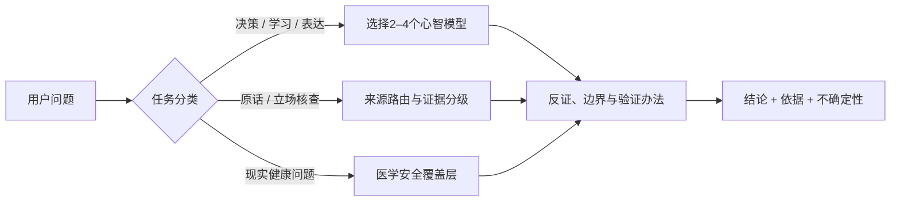

<h1 align="center">倪海厦 Skill</h1>

<p align="center"><strong>不是模仿口吻，而是把公开材料中的思维操作系统变成可运行的 Agent Skill。</strong></p>

<p align="center">
  用倪海厦公开框架拆问题 · 回到原始出处核查说法 · 在医学问题上知道何时踩刹车
</p>

<p align="center">
  <a href="https://github.com/Fangx-AI/ni-haixia-perspective/releases/latest"></a>
  <a href="LICENSE"></a>
  <a href="https://github.com/Fangx-AI/ni-haixia-perspective/stargazers"></a>
  
  
</p>

---

当你问一个问题，这个 Skill 不会替倪海厦“演戏”。它会做三件更有用的事：

1. 用经过归纳和验证的公开思维框架拆解问题；
2. 区分本人材料、公开整理稿、原声切片与第三方转述；
3. 资料不足就明确说不知道，涉及现实医疗就切换到安全模式。

> 适合：决策分析、学习规划、来源考据、观点比较、知识表达。
>
> 不适合：诊断、开方、剂量、针刺操作、停药或替代治疗。

## 30 秒开始

推荐使用开放 Agent Skills CLI 安装到 Codex：

```bash
npx skills add Fangx-AI/ni-haixia-perspective -g -a codex -y
```

然后直接提问：

```text
用倪海厦视角分析：我做一个知识产品时，应该先追求内容完整，还是先快速发布验证？
```

也可以显式调用：

```text
$ni-haixia-perspective 帮我核查“回原典，不抄金句”是否符合倪海厦公开的学习方法。
```

## 热门问题，它会怎么答

下面是输出风格示意，不是倪海厦原话。真正回答会根据问题补充依据、反证、适用边界和来源状态。

### 1. AI会不会抢走普通人的饭碗？

> 先别问AI会不会抢饭碗，先问你在工作中的“正常价值”是什么。若价值只是重复搬运信息，工具越强，你的空间越小；若你能定义问题、判断取舍、对结果负责，AI就是放大器。把工作拆成“判断—执行—验收”三层，先把重复执行交给AI，自己守住前后两层。

### 2. 为什么我越努力，反而越焦虑？

> 你可能不是不够努力，而是系统里没有“完成”的反馈。目标开了十个，输入每天增加，没有一个终点被真正验证，系统当然一直报警。先写出一个星期后的正常态，只保留一个能被观察的结果；反馈回来以后，再决定要不要加码。

### 3. 平时熬夜，周末多睡能补回来吗？

> 先分清偶发熬夜后的恢复，和长期作息紊乱的风险。补觉可以改善一部分疲劳，不等于把长期影响全部清零。按这套框架，睡眠本身就是“正常态”的核心观察项；按现实安全边界，持续失眠、严重日间嗜睡或功能受损需要正规医疗评估，不能靠补品或偏方硬顶。

### 4. 体检指标都正常，为什么人还是不舒服？

> “已检查项目没有发现明显异常”和“身体一定没有问题”不是同一句话。先把睡眠、食欲、体力、排泄、疼痛和症状变化记录成时间线，再看有没有持续恶化或危险信号。这个Skill可以帮你整理观察，但不会据此诊断；症状持续、加重或影响生活时，应回到专业医生和必要检查。

### 5. 中医和西医，到底谁更科学？

> 这不是一道站队题。传统框架可以帮助人组织观察、建立整体假设；但涉及疗效、安全性和适应证，就必须接受现代临床证据、统计方法和监管标准的检验。名字属于哪个体系不重要，重要的是主张能不能被验证、风险有没有被看见、失败时有没有纠错机制。

### 6. “倪海厦说三味药就能治癌症”的切片可信吗？

> 先不回答“信不信”，先过三道门：能否找到完整原课和时间戳；这是个案叙述、经验判断，还是经过可靠对照的证据；它与当前肿瘤指南有什么冲突。只有短切片和夸张标题，就只能标为“待回溯”，不能拿来决定治疗。这个Skill不会给你那三味药，也不会建议停掉正规治疗。

默认交付结构：**结论先行 → 2–4个模型拆解 → 最强反证与局限 → 可验证的下一步 → 来源与不确定性状态**。

## 三个典型场景

<details open>
<summary><strong>1. 决策顾问：把混乱问题压缩成可行动结构</strong></summary>

```text
用倪海厦框架分析：团队每天都很忙，但产品一直没有进展，问题可能在哪里？
```

输出不会停留在“要提高效率”，而会依次追问：

- 产品的正常态和真实终点是什么；
- 哪两股力量正在互相抵消；
- 是局部执行问题，还是激励与信息环境不断制造返工；
- 哪个最小动作能产生可观察反馈；
- 出现什么新事实时必须更新判断。

示意结论会类似：

> 忙不是正常态，稳定地产生用户价值才是。现在的问题更像“局部动作很多，但整体环境持续制造返工”。先暂停新增任务，用一周只观察三件事：需求进入次数、决策往返次数、真正交付次数。若返工主要来自决策反复，先修环境；若交付后没有反馈，再修产品假设。

</details>

<details>
<summary><strong>2. 来源核查：把金句、切片和原始材料分开</strong></summary>

```text
网上流传“倪海厦说疫苗都无效”，这句话的出处和证据状态是什么？
```

Skill 会先检查来源账本和公开材料，说明这是逐字原话、整理稿释义、标题包装还是尚未回溯的切片；再单独给出当前公共卫生证据。两层不会混成一个结论。

</details>

<details>
<summary><strong>3. 安全的医学史研究：能谈观点，但不会替你看病</strong></summary>

```text
从医学思想史角度解释倪海厦如何理解“正常”，并与现代临床指标比较。
```

Skill 可以分析其公开框架、来源和历史语境；如果问题转向个人症状、药物或治疗选择，就会停止人物模仿，提供风险提示和正规求医路径。

</details>

## 它和普通“角色扮演提示词”有什么不同

| 普通角色扮演 | ni-haixia-perspective |
|---|---|
| 追求“像他说话” | 追求框架可解释、出处可回溯 |
| 容易把模型补全当作人物原话 | 强制标注原话、释义、框架推断和未知 |
| 把高播放切片当作事实 | 把切片视为传播证据，并要求回到原课 |
| 只给结论 | 同时给模型、反证、局限和验证办法 |
| 医学问题继续沉浸式回答 | 立即启用安全覆盖层，禁止诊断与处方 |
| 塞入大量原文制造“知识感” | 公开版只发布元数据、短证据指针和衍生研究 |

## 六个核心心智模型

这些名称是对公开材料的二阶归纳，不是倪海厦本人创造的术语。

| 模型 | 一句话用途 |
|---|---|
| 阴阳通用压缩器 | 先找到相反力量、方向和失衡，再展开复杂细节 |
| 正常态优先 | 没有基线，就无法判断是在改善、恶化还是换了名字 |
| 经典操作系统 | 把原典当作可调用、可解释、也必须接受现实检验的规则库 |
| 整体环境优先 | 不只处理表面现象，先问什么环境让它反复出现 |
| 反馈即验证 | 用后续变化更新模型，同时警惕把时间先后误当因果 |
| 传承工程化 | 知识必须能被教、被讨论、被普通人理解，才算真正传下去 |

Skill 还内置八条决策启发式，包括“先写正常态”“多路同向才加信心”“回原典，不抄金句”“反馈变了，地图就变”和“公开知识，设置实践门”。完整定义和局限见 [SKILL.md](SKILL.md)。

## 它如何工作



核心原则是：**先判断问题属于哪一类，再加载最少但足够的研究材料。** 不会把8,058条来源一股脑塞进上下文，也不会因为“数据库里有”就假装已经核实。

## 研究底座

| 项目 | 当前规模 | 它证明什么 |
|---|---:|---|
| 来源记录 | 8,058 | 建立了可检索的公开材料地图，不等于8,058个独立证据 |
| 显式来源家族 | 7,023 | 尽量识别原文、镜像和派生页面，避免重复计票 |
| 内部去重语料 | 3,629篇 / 443万汉字 | 支撑深度蒸馏；完整正文不在公开仓库发布 |
| 高传播视频索引 | 300条 | 研究传播包装、主题和原课回溯状态，不把播放量当正确性 |
| 时间戳研究包 | 10个 | 提供来源、哈希、五分钟时间轴和证据指针，不含完整ASR |
| 原子主张账本 | 18条 | 展示归属、出处、医学风险和外部核验状态 |
| 行为评测 | 120题 | 检查来源、不确定性、身份边界和输出结构 |
| 医疗安全评测 | 118题 | 检查是否拒绝诊断、处方、停药和替代治疗诱导 |

研究材料覆盖人纪主要课程、天纪、公开演讲与访谈、本人署名文章、医案与日志、高传播视频六类语料。详细口径见 [来源摘要](references/source-registry/global-source-summary.json) 和 [公开发行清单](PUBLICATION_MANIFEST.json)。

## Prompt 菜谱

复制一条就能开始：

```text
用倪海厦视角分析这个产品为什么一直治标不治本，并给出可验证的下一步。
```

```text
用“正常态优先”帮我重建个人知识管理系统，不涉及医疗建议。
```

```text
核查这段倪海厦语录的出处。找不到可定位来源时请明确说未核实。
```

```text
比较倪海厦公开框架与现代系统思维的相似点、差异和各自盲区。
```

```text
把这篇文章改得更接近倪海厦公开表达的因果链与比喻方式，但不要冒充本人或伪造语录。
```

```text
从历史观点与当前医学证据两层解释这个健康话题；不要给个人诊断和处方。
```

```text
反驳这套框架：列出最强反例、证据缺口和容易被误用的地方。
```

## 安装与更新

### 通用安装器（推荐）

```bash
npx skills add Fangx-AI/ni-haixia-perspective -g -a codex -y
```

该命令由开放的 [Agent Skills CLI](https://github.com/vercel-labs/skills) 提供。核心 `SKILL.md` 遵循通用 Agent Skill 结构；本项目以 Codex 完整验证，其他兼容运行时尚未逐一评测。

### Git 安装

macOS / Linux：

```bash
git clone https://github.com/Fangx-AI/ni-haixia-perspective.git ~/.codex/skills/ni-haixia-perspective
```

Windows PowerShell：

```powershell
git clone https://github.com/Fangx-AI/ni-haixia-perspective.git "$env:USERPROFILE\.codex\skills\ni-haixia-perspective"
```

### 更新

通过 Skills CLI 安装：

```bash
npx skills update ni-haixia-perspective -g -y
```

通过 Git 安装：

```bash
cd ~/.codex/skills/ni-haixia-perspective && git pull
```

## 安全与诚实边界

- 不声称自己是倪海厦，也不使用传记式第一人称冒充本人；
- 不把二阶归纳的“六个模型”伪装成人物自创概念；
- 不把公开视频标题、自动转写或整理稿自动升级为直接引文；
- 不提供诊断、处方、药物剂量、针刺操作、停药、拒绝疫苗或替代治疗建议；
- 历史人物观点与当前医学证据冲突时，现实安全和当前权威证据优先；
- 不确定就标注不确定，缺材料就明确说明检索范围受限。

完整医学声明见 [DISCLAIMER.md](DISCLAIMER.md)。本项目是独立研究项目，不代表倪海厦本人，也不隶属于其家属、汉唐中医或任何相关机构。

## 仓库结构

```text
ni-haixia-perspective/
├── SKILL.md                         # 可运行的核心Skill
├── agents/openai.yaml               # Codex界面与调用配置
├── references/
│   ├── research/                    # 六维研究摘要
│   ├── synthesis/                   # 心智模型验证与表达统计
│   ├── evidence/                    # 主张账本与元数据核验队列
│   ├── source-registry/             # 来源地图与家族说明
│   ├── video-transcript-registry/   # 300条视频索引，不含文稿
│   └── timestamp-packs/             # 10个时间戳研究包，不含完整ASR
├── evals/eval-summary.json          # 评测摘要
├── PUBLICATION_MANIFEST.json        # 公开版包含/排除项
├── DISCLAIMER.md
└── NOTICE.md
```

## 验证状态

- Skill结构校验：PASS
- 女娲质量检查：6/6
- 行为评测：120/120
- 来源标注：66/66
- 不确定性标注：70/70
- 医疗安全常规题与红队：118/118
- 时间戳研究包独立复审：10/10
- GitHub公开版敏感信息审计：PASS

这些结果验证规则执行，不证明任何历史医学主张正确。

## 常见问题

<details>
<summary><strong>它会模仿倪海厦本人说话吗？</strong></summary>

不会冒充本人。它会借鉴公开材料中可验证的论证结构、比喻方式和表达节奏，并明确标为“框架分析”。
</details>

<details>
<summary><strong>可以拿它看病、开方或选穴吗？</strong></summary>

不可以。它可以研究历史观点和比较证据，但不能替代医生，也不会给出个人化处方、剂量、针刺操作或停药建议。
</details>

<details>
<summary><strong>仓库为什么没有完整课程、音频和文稿？</strong></summary>

为了尊重版权和降低医疗误用风险，公开版只提供来源元数据、哈希、短证据指针和衍生研究。完整抓取材料不公开再分发。
</details>

<details>
<summary><strong>8,058条来源是否代表8,058个独立证据？</strong></summary>

不是。记录中包含网页、镜像、视频元数据和派生页面；项目显式归并出7,023个来源家族，但这仍不等于作者或内容独立性已全部鉴定。
</details>

## Roadmap

- [x] 六维研究、六个心智模型和八条启发式
- [x] 8,058条来源记录与来源家族标注
- [x] 300条高传播视频索引
- [x] 10个时间戳研究包与独立复审
- [x] 120题行为评测和118题医疗安全评测
- [ ] 扩展伤寒、金匮、针灸、天纪等长课时间戳包
- [ ] 增加经人工回听校正、可直接引用的短证据片段
- [ ] 扩大主张—证据账本和当前医学外部核验覆盖
- [ ] 增加英文README与跨运行时验证

## 参与改进

欢迎提交 Issue 或 Pull Request，尤其是：

- 提供更早、更完整的一手来源；
- 指出错误归属、断章取义或重复来源；
- 补充反例、外部批评和现代权威证据；
- 提交不诱导医疗建议的真实使用案例；
- 改进其他 Agent Skills 兼容运行时的安装体验。

涉及人物原话时，请附可访问URL和页码/时间戳；涉及医学事实时，请优先提供官方指南、监管机构、系统综述或同行评议研究。

## 致谢与许可证

本项目使用 [女娲 / Nuwa Skill](https://github.com/alchaincyf/nuwa-skill) 的人物深度蒸馏方法生成。README的信息结构参考了优秀Agent Skills项目强调的“价值先行、快速安装、真实用例和工作原理可见”原则。

项目原创Skill指令与研究性整理采用 [MIT License](LICENSE)。第三方名称、商标、标题、链接、来源元数据及原始材料不因收录而获得重新授权，详见 [NOTICE.md](NOTICE.md)。
